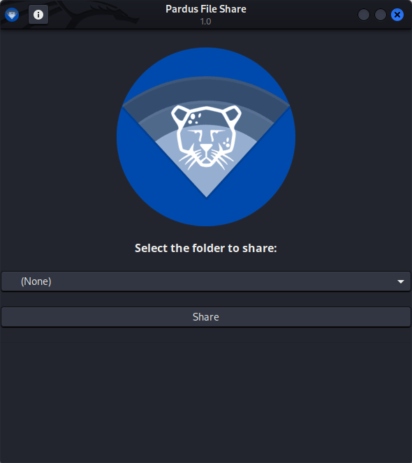
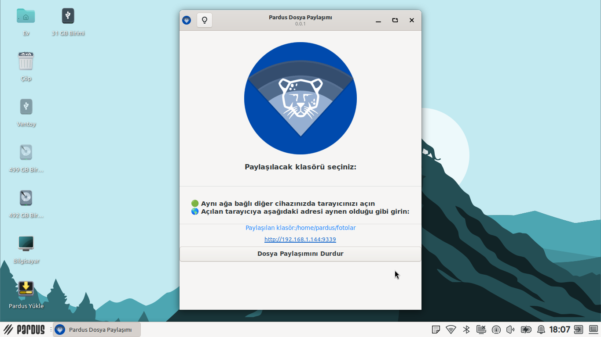
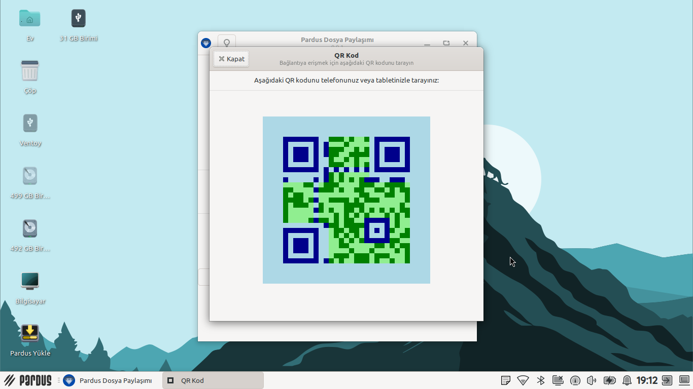
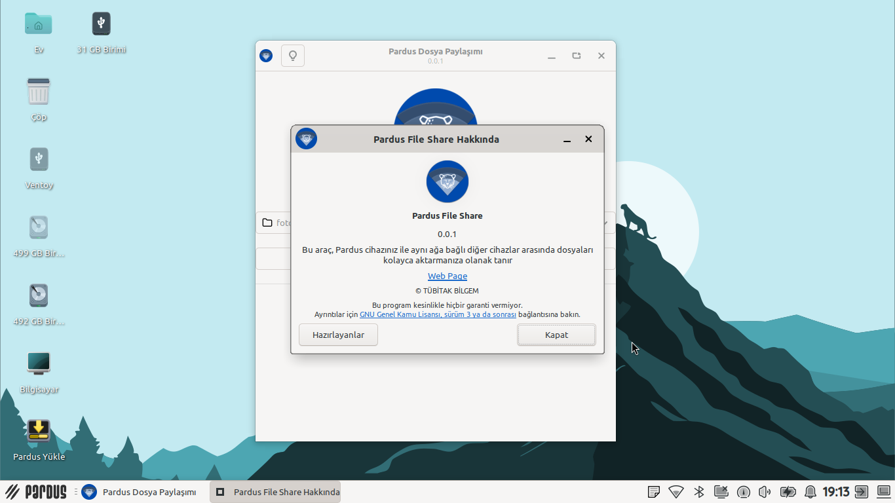
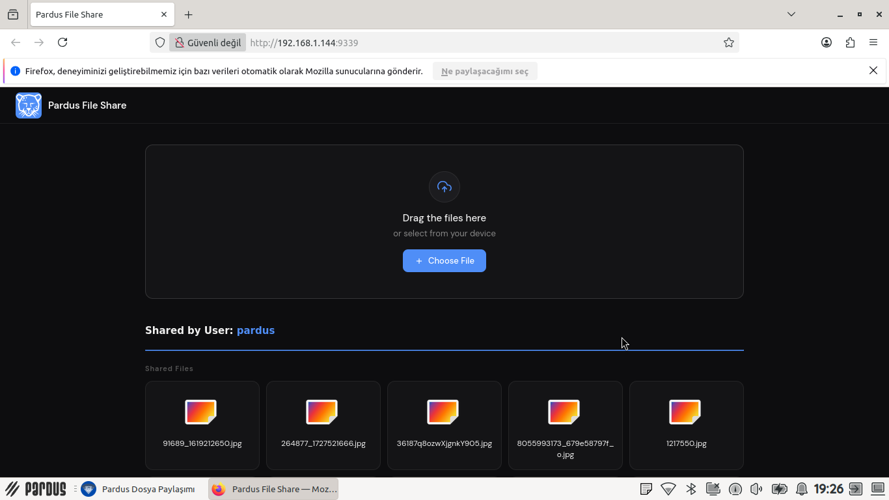

# pardus-fileshare
Software for Pardus that enables easy browser-based file sharing over a local network among other devices

### **Dependencies**

This application is developed based on Python3 and GTK+ 3. Dependencies:
```bash
python3-flask
gunicorn
```

Clone the repository
```bash
git clone https://github.com/heyderismayilli092/pardus-fileshare ~/pardus-fileshare
```

Run application
```bash
python3 ~/pardus-fileshare/src/main.py
```

### Build .deb package
```bash
sudo apt install devscripts git-buildpackage
sudo mk-build-deps -ir
gbp buildpackage --git-export-dir=/tmp/build/pardus-fileshare -us -uc
```

### **Screenshots**







### Phone Screenshot



NOTE: This software was prepared as part of the "Teknofest 2026 Pardus Bug Finding and Suggestion Competition"

